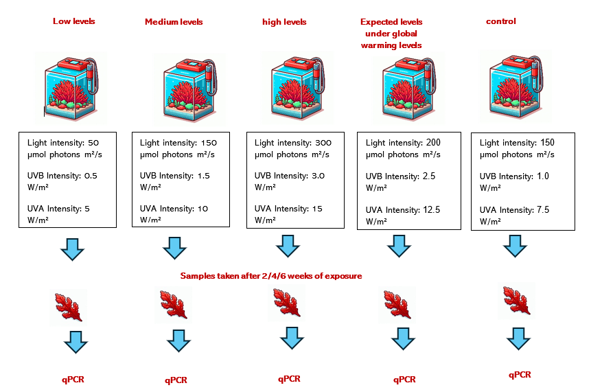

### Overview

Global warming is significantly impacting marine ecosystems by raising water temperatures, increasing acidity, and intensifying UV radiation, all of which pose serious challenges to marine organisms, particularly macroalgae. *Gracilaria gracilis*, a red alga found along Israel's Mediterranean coast, plays a vital role in its ecosystem. As a primary producer, it supports marine life and is also commercially valuable for its bioactive compounds.

Carotenoids, pigments crucial for photosynthesis, also protect algae from light-induced stress. They help absorb excess light and neutralize harmful free radicals, thus safeguarding the photosynthetic machinery. In the context of global warming, which is expected to increase UVB radiation and alter light intensity, understanding how *G. gracilis* modulates carotenoid production is essential for predicting its resilience and adaptability.

Our study aims to investigate the impact of varying light intensities and UV radiation on carotenoid and other natural prodact genes expression in *G. gracilis*, simulating current and future climate scenarios. We will expose the algae to low, medium, and high light and UV levels over six weeks, mimicking natural day-night cycles. Using quantitative PCR (qPCR) with GAPDH as a reference gene, we will measure changes in carotenoid and naturl product gene expression. This research will provide insights into how *G. gracilis* responds to environmental stressors linked to climate change and offer guidance for optimizing its commercial cultivation to produce high-value natural products.

To study the impact of light and UV radiation on *Gracilaria gracilis*, samples will be collected from the Israeli Mediterranean coast, ensuring that collection times are consistent to minimize variability. After rinsing, these samples will be placed in aerated seawater aquariums. 

In the controlled environment, multiple aquariums will be prepared, each exposed to different light intensities and UV radiation levels using LED lights and UVB lamps. A control group will be maintained with all other environmental factors, such as temperature, salinity, and nutrients, kept constant. Samples will be harvested after 2, 4, and 6 weeks to assess the effects over time.

Carotenoid and natural product biosynthesis genes will be identified through public databases such as [NCBI](https://www.ncbi.nlm.nih.gov/), with homologous genes in *G. gracilis* found using [BLAST](https://blast.ncbi.nlm.nih.gov/Blast.cgi).

The reference gene for the qPCR process was selected from previous articles, and the first gene selected for testing is thiG which involved in the biosynthesis of thiamine (vitamin B1), you can read more about the selection process [here](https://github.com/OfekRainish/Impact-of-Light-and-Radiation-on-Carotenoid-Gene-Expression-in-the-Red-Alga-Gracilaria-gracilis/blob/main/posts/2024-07-10-Primer%20selection%20for%20qPCR%20Experiment%20-%20class.md).

Specific primers will be designed using [Primer3](https://primer3.ut.ee/), and their specificity will be confirmed through PCR validation. A full protocol on primer design can be found [here](https://github.com/OfekRainish/Impact-of-Light-and-Radiation-on-Carotenoid-Gene-Expression-in-the-Red-Alga-Gracilaria-gracilis/blob/main/posts/2024-07-04-Primer%20Design%20-%20class.md).

For gene expression quantification, RNA will be extracted from the samples and its quality assessed using NanoDrop and gel electrophoresis. This RNA will then be converted into cDNA, and qPCR will be performed using the GAPDH gene for normalization. The resulting data will be analyzed statistically to determine significant differences in gene expression across the various treatment conditions using [this](https://github.com/OfekRainish/Impact-of-Light-and-Radiation-on-Carotenoid-Gene-Expression-in-the-Red-Alga-Gracilaria-gracilis/blob/main/scripts/R%20script%20ggplot.r) R script, and by [this](https://github.com/OfekRainish/Impact-of-Light-and-Radiation-on-Carotenoid-Gene-Expression-in-the-Red-Alga-Gracilaria-gracilis/blob/main/posts/2024-07-05-Protocol%20for%20Analyzing%20qPCR%20Results%20class.md) protocol.

In addition to the wet work, bioinformatic analysis was conducted.

We wanted to see which species *Gracilaria gracilis* is close to, since it is possible that they behave similarly to *Gracilaria gracilis* in response to different light and radiation conditions. For this purpose we built a phylogenetic tree according to [this](https://github.com/OfekRainish/Impact-of-Light-and-Radiation-on-Carotenoid-Gene-Expression-in-the-Red-Alga-Gracilaria-gracilis/blob/main/posts/2024-07-04-Protocol%20-%20Creating%20a%20Phylogenetic%20Tree%20Based%20on%20a%20Conserved%20Gene%20-%20class.md) protocol.

### Impact

This research will elucidate *G. gracilis*'s adaptive mechanisms through carotenoid gene expression in response to varying light and radiation levels, enhancing our understanding of macroalgae resilience to climate change. Furthermore, it will provide critical insights for the commercial cultivation of *G. gracilis* for high-value carotenoid production, contributing to the sustainable development of coastal ecosystems and the blue economy.

### Additional Research Tools and Learning

In addition to my main research, I explored tools that would enhance my knowledge and assist in my research efforts.

1. **Graph Creation and Statistical Analysis with R:**
   I experimented with creating graphs and performing statistical analyses using the R language. The code mentioned above was used along with [this_code](https://github.com/OfekRainish/Impact-of-Light-and-Radiation-on-Carotenoid-Gene-Expression-in-the-Red-Alga-Gracilaria-gracilis/blob/main/scripts/R%20script%20ggplot.r) and [this_data](https://github.com/OfekRainish/Impact-of-Light-and-Radiation-on-Carotenoid-Gene-Expression-in-the-Red-Alga-Gracilaria-gracilis/blob/main/Mata%20data/Photosurvey_metadata%20class.csv) to generate a graph illustrating the percentage of coverage (in images) of chordata at two different sites in the Mediterranean Sea (Achziv and Sdot Yam), across two different seasons (autumn and spring), and at three different depths (10, 25, 45 meters).

   You can read more about this experience [here](https://github.com/OfekRainish/Impact-of-Light-and-Radiation-on-Carotenoid-Gene-Expression-in-the-Red-Alga-Gracilaria-gracilis/blob/main/posts/2024-07-17-Data%20anlysis%20task%20-%20class.md).

   I can leverage this knowledge to create similar graphs that depict the expression levels of a specific natural substance or carotenoid under varying light intensities and radiation exposures.

2. **Molecular Network Creation with GNPS:**
   I learned to use the GNPS software to create molecular networks based on MS/MS spectral similarity. For example, I analyzed the surfactin molecule and identified molecules with similar MS/MS profiles. This tool enables the discovery of new molecules and helps in understanding structural modifications compared to known molecules.

   More about my experience with GNPS can be read [here](https://github.com/OfekRainish/Impact-of-Light-and-Radiation-on-Carotenoid-Gene-Expression-in-the-Red-Alga-Gracilaria-gracilis/blob/main/posts/2024-08-21-%20GNPS%20Molecular%20Network.md).

   To add another layer to my research, I could investigate natural materials similar to those I focus on in my studies and determine if they are also produced by *Gracilaria gracilis* or related species.

